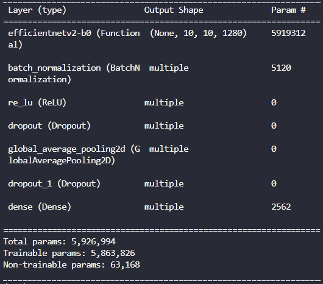

# ksh-case2-LabNote01

|                제목                |                             내용                             |
| :--------------------------------: | :----------------------------------------------------------: |
| 모델 요약 (ex. 블록 개수, 구조 등) |  |
|             optimizer              |                             Adam                             |
|             scheduler              |                     CosineDecayRestarts                      |
|         init learning rate         |                            0.0005                            |
|            decay steps             |                             1200                             |
|             batch size             |                              16                              |
|               epoch                |                              50                              |
|          GPU 여부 (O / X)          |                              O                               |
|           loss function            |                   CategoricalCrossentropy                    |
|             best model             |                                                              |
|             Train Loss             |                            0.0278                            |
|             Test Loss              |                            0.1163                            |
| Train accuracy / recall / F1-Score |                       1.0 / 1.0 / 1.0                        |
| Test accuracy / recall / F1-Score  |                   0.9692 / 0.9726 / 0.9726                   |
|        val2_cnt (total 50)         |                              48                              |
|        must_cnt (total 10)         |                           10 / 10                            |