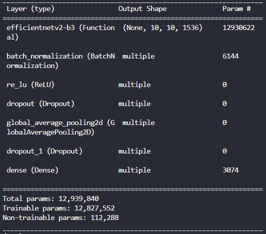

# ksh-case5-LabNote

<table style="border: 2px; text-align:center;">
  <tr style="font-weight: bold;, font-size: 30px;">
    <td> 제목 </td>
    <td> 내용 </td>
  </tr>
  <tr>
    <td> 모델 요약 (ex. 블록 개수, 구조 등) </td>
    <td>  </td>
  </tr>
  <tr>
    <td> optimizer </td>
    <td> Adam </td>
  </tr>
  <tr>
    <td> scheduler </td>
    <td> CosineDecayRestarts </td>
  </tr>
  <tr>
    <td> init learning rate </td>
    <td> 0.0005 </td>
  </tr>
  <tr>
    <td> decay steps </td>
    <td> 1200 </td>
  </tr>
  <tr>
    <td> batch size </td>
    <td> 16 </td>
  </tr>
  <tr>
    <td> epoch </td>
    <td> 50 </td>
  </tr>
  <tr>
    <td> GPU 여부 (O / X) </td>
    <td> O </td>
  </tr>
  <tr>
    <td> loss function </td>
    <td> CategoricalCrossentropy </td>
  </tr>
  <tr>
    <td colspan="2" style="font-weight: bold;, font-size: 30px;"> best model </td>
  </tr>
  <tr>
    <td> Train Loss </td>
    <td> 0.0234 </td>
  </tr>
  <tr>
    <td> Test Loss </td>
    <td> 0.1018 </td>
  </tr>
  <tr>
    <td> Train accuracy / recall / F1-Score </td>
    <td> 1.0 / 1.0 / 1.0 </td>
  </tr>
  <tr>
    <td> Test accuracy / recall / F1-Score </td>
    <td> 0.9846 / 0.9726 / 0.9861 </td>
  </tr>
  <tr>
    <td> val2_cnt (total 50) </td>
    <td> 48 </td>
  </tr>
  <tr>
    <td> must_cnt (total 10) </td>
    <td> 10 </td>
  </tr>
</table>

이전 실험과 다른 점 : EfficientNet V2 B2 => B3 모델로 변경

결론 : 동일 조건에서 B3 모델이 B2에 비해 성능이 좋은 것 같다. B0 ~ B3까지 동일 조건에서 실험 결과 B0가 가장 성능이 좋았다. B0 hyper parameter 변경하면서 테스트 해봐야겠다.

