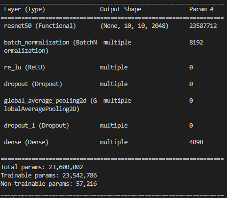

# hsd-case8-LabNote

<table style="border: 2px; text-align:center;">
  <tr style="font-weight: bold;, font-size: 30px;">
    <td> 제목 </td>
    <td> 내용 </td>
  </tr>
  <tr>
    <td> 모델 요약 (ex. 블록 개수, 구조 등) </td>
    <td>  </td>
  </tr>
  <tr>
    <td> optimizer </td>
    <td> Adam </td>
  </tr>
  <tr>
    <td> scheduler </td>
    <td> CosineDecayRestarts </td>
  </tr>
  <tr>
    <td> init learning rate </td>
    <td> 0.001 </td>
  </tr>
  <tr>
    <td> decay steps </td>
    <td> 1200 </td>
  </tr>
  <tr>
    <td> batch size </td>
    <td> 16 </td>
  </tr>
  <tr>
    <td> epoch </td>
    <td> 100 </td>
  </tr>
  <tr>
    <td> GPU 여부 (O / X) </td>
    <td> O </td>
  </tr>
  <tr>
    <td> loss function </td>
    <td> CategoricalCrossentropy </td>
  </tr>
  <tr>
    <td colspan="2" style="font-weight: bold;, font-size: 30px;"> best model </td>
  </tr>
  <tr>
    <td> Train Loss </td>
    <td> 0.0770 </td>
  </tr>
  <tr>
    <td> Test Loss </td>
    <td> 0.1687 </td>
  </tr>
  <tr>
    <td> Train accuracy / recall / F1-Score </td>
    <td> 0.9975 / 0.9966 / 0.9979 </td>
  </tr>
  <tr>
    <td> Test accuracy / recall / F1-Score </td>
    <td> 0.9077 / 1.0000 / 0.9241 </td>
  </tr>
  <tr>
    <td> val2_cnt (total 50) </td>
    <td> 49 </td>
  </tr>
  <tr>
    <td> must_cnt (total 10) </td>
    <td> 10 </td>
  </tr>
</table>

이전 실험과 다른 점 : decay-steps 1000 -> 1200

결론: Test Loss가   0.7501 -> 0.1687로 낮아짐. 

decay-steps는 800으로 고정으로 다음 실험 진행